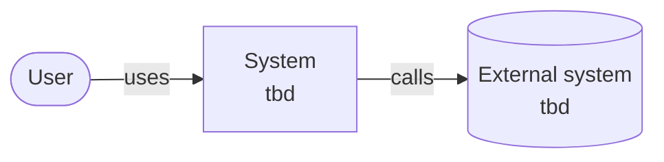

# Architecture overview

This page describes the system as it is now, using the [arc42](https://arc42.org/overview) section numbering, trimmed. Diagrams follow the [C4 model](https://c4model.com/) and are written as Mermaid flowcharts, which GitHub and Obsidian both render. Mermaid's dedicated C4 syntax is still experimental.
It is a living document: update it in the same pull request that changes the architecture, and bump `last-reviewed`.

> [!NOTE]
> **Template state:** nothing is built yet. Fill in each section once the first capabilities are specified. Write "n/a" for sections that do not apply yet instead of deleting them.
> Split a section into its own file in this folder when it outgrows a screen, and link it from here.

## 1. Introduction and goals

<!-- Link the product overview; list the three to five quality goals that drive the architecture, in priority order. -->

| Priority | Quality goal | Scenario that makes it measurable |
| --- | --- | --- |
| 1 | *tbd* | *tbd* |

## 2. Constraints

<!-- Technical, organizational and regulatory constraints. Link the ADR that introduced each one. -->

- Implementation language: not decided yet, see [ADR-0005](../decisions/0005-choose-primary-implementation-language.md).

## 3. Context and scope

<!-- C4 level 1: the system, its users and the external systems it talks to. -->

## 4. Solution strategy

<!-- The handful of fundamental choices (style, stack, key patterns), each linking to its ADR. -->

## 5. Building block view

<!-- C4 level 2: containers and main components. Map each to the capabilities in openspec/specs it implements. -->

| Building block | Responsibility | Capabilities (specs) |
| --- | --- | --- |
| *tbd* | | |

## 6. Runtime view

<!-- Sequence diagrams for the few flows that matter most. -->

## 7. Deployment view

<!-- Environments, infrastructure, how artifacts are built and released. -->

## 8. Cross-cutting concepts

<!-- Error handling, security, observability, persistence, configuration, testing strategy. -->

## 9. Architecture decisions

See the [decision log](../decisions/README.md). This page only links to ADRs; it never repeats their reasoning.

## 10. Quality requirements

<!-- Concrete quality scenarios beyond the top goals in section 1. Testable ones should become OpenSpec requirements. -->

## 11. Risks and technical debt

| Risk or debt | Impact | Mitigation or tracking issue |
| --- | --- | --- |
| *tbd* | | |

## 12. Glossary

See the [glossary](../glossary.md).
