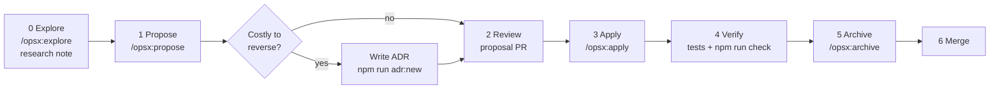

# Development workflow

This is how work moves from an idea to merged code. Humans and AI agents follow the same steps.
It builds on [OpenSpec](https://github.com/Fission-AI/OpenSpec), on decision records ([ADR-0001](../decisions/0001-record-architecture-decisions-with-madr.md)) and on the doc types described in [documentation lifecycle](documentation-lifecycle.md).

## Where does this information go?

Before writing anything, pick the right home. Each piece of knowledge lives in exactly one place. Other places link to it.

| You have... | Put it in | Nature |
| --- | --- | --- |
| A change to what the system must do (new feature, changed behavior, removed behavior) | OpenSpec change in `openspec/changes/<change-id>/` | Proposal, becomes spec on archive |
| The current, agreed behavior of the system | `openspec/specs/<capability>/spec.md` (only edited through archived changes) | Normative, current state |
| A choice that is costly to reverse (technology, structure, pattern, trade-off) | ADR in `docs/decisions/` | Normative, append-only |
| An exploration, spike, comparison or reading summary | Research note in `docs/research/` | Non-normative, dated |
| How the system is built right now | `docs/architecture/` | Living |
| Steps to accomplish a task (set up, release, debug) | `docs/guides/` | Living |
| Facts to look up (configuration, commands, interfaces) | `docs/reference/` | Living |
| A domain or project term | [`docs/glossary.md`](../glossary.md) | Living |
| A rule that guides trade-offs across the whole project | [`docs/principles.md`](../principles.md), changed through an ADR | Living, stable |
| Rules and context for AI agents | `AGENTS.md` (root or nested) or a skill | Living |
| Work items, bugs, discussions | GitHub issues and pull requests | Tracking |

A bug fix that restores specified behavior needs no spec change: fix it, add a test, reference the requirement in the PR.
A refactor or tooling change without behavior change either skips OpenSpec or uses a change with `skip_specs: true`.

## The loop

### 0. Explore (optional)

For anything unclear, think before you specify. Use `/opsx:explore` with an agent, or write a research note from [the template](../templates/research-note.md).
Exploration produces understanding, not code.

### 1. Propose

Create a change: `/opsx:propose "<what and why>"` in an agent, or `npx openspec new change <change-id>` by hand. The change folder holds:

- `proposal.md`: why, what changes, which capabilities are affected
- `specs/<capability>/spec.md`: delta specs (`## ADDED|MODIFIED|REMOVED|RENAMED Requirements`)
- `design.md`: technical approach, only when the change needs one
- `tasks.md`: checklist the implementation follows

Use a kebab-case, verb-first change id: `add-user-login`, `change-invoice-rounding`, `remove-legacy-export`.

If the design contains a decision that is costly to reverse, record it as an ADR (`npm run adr:new -- "Title"`) with status `proposed`, and link it from `design.md`.
Keep the reasoning in the ADR, not in the design file: the change is archived, the ADR stays findable.

### 2. Review

Open a pull request as soon as the proposal exists. For larger changes, agree on the proposal before any implementation. This "spec PR" is the cheapest moment to change direction.
Run `npm run specs:validate` before asking for review.

### 3. Apply

Implement the tasks: `/opsx:apply <change-id>`. Tick each task in `tasks.md` as it is done.
If implementation shows the spec was wrong, update the change's delta specs first, then the code. Specs and code must not drift.

### 4. Verify

- Project tests pass (commands in [AGENTS.md](../../AGENTS.md#commands)).
- `npm run check` passes: specs validate, Markdown lint, decision log, links, review dates.
- Docs affected by the change are updated in the same PR: architecture, guides, reference, glossary.
- ADRs linked from the change move from `proposed` to `accepted` (or `rejected`).

### 5. Archive

`/opsx:archive <change-id>` (or `npx openspec archive <change-id>`) merges the delta specs into `openspec/specs/` and moves the change to `openspec/changes/archive/YYYY-MM-DD-<change-id>/`.
Archive in the same PR, before merging, so `main` always has current specs and no finished changes left open.

### 6. Merge

Squash or merge according to the repository settings. The PR description links the change and any ADRs.

## Definition of done

- [ ] Behavior changes are reflected in `openspec/specs/` (change archived)
- [ ] Significant decisions have an ADR with a final status
- [ ] Tests cover the new or changed scenarios
- [ ] Affected living documents are updated and their `last-reviewed` is bumped
- [ ] New terms are in the glossary
- [ ] `npm run check` and the project's build/test commands pass
- [ ] If an agent kept making the same mistake, `AGENTS.md` or a skill now prevents it

## Conventions

- **Branches:** `change/<change-id>` for OpenSpec changes, `fix/<short-name>` or `docs/<short-name>` otherwise.
- **Commits:** [Conventional Commits](https://www.conventionalcommits.org/) (`feat:`, `fix:`, `docs:`, `refactor:`, `chore:`), imperative mood.
- **Pull requests:** fill in the [PR template](../../.github/pull_request_template.md). One change per PR where possible.
